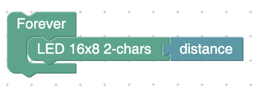

# KidBright_Ultrasonic_Plugin

**Plugin สำหรับใช้ Ultrasonic ด้วย KidBright**

# วิธีติดตั้ง Plugin

เปิด **KidBrightIDE** และเลือก Menu ที่มีชื่อว่า Plugins และ เลือก **Install Plugin** แล้วกดเลือกไฟล์ **ultrasonic.zip** ที่ Download มาจากปุ่ม Download ข้างบน 
**KidBrightIDE** จะทำการ restart รอบนึง เมื่อเปิดขึ้นมาใหม่แล้วจะโชว์ Plugin ที่แถบด้านซ้ายมือ

# วิธีเชื่อมต่อ Hardware

- Vcc ต่อกับขา 5v
- Trig ต่อกับขา 18
- Echo ต่อกับขา 19
- Gnd ต่อกับขา GND หรือ 23, 21

## ตัวอย่างโปรแกรม

ถ้าหากบน LED ขึ้นค่าระยะทาง แปลว่าสามารถทำงานได้สำเร็จ
